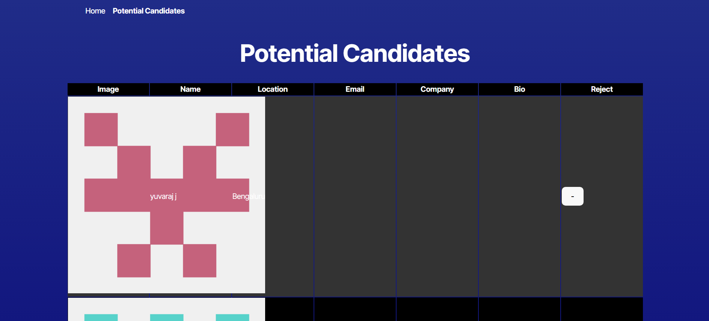

# Candidate Search Tool

## Description
My **Candidate Search Tool** is a web application that allows users to search for and display GitHub profiles in the browser. This project focuses on building the front end using **TypeScript**, integrating it with the backend API, and deploying the complete application to **Render**.

## Features
- **GitHub User Search**: Find GitHub users by their username.
- **Profile Display**: View user details such as name, avatar, and repository information.
- **Responsive Design**: A clean and intuitive interface optimized for all devices.

## Tech Stack
- **Frontend**: React, TypeScript, CSS
- **Backend**: Pre-built API interacting with the GitHub API
- **Deployment**: Render

## Installation

### Prerequisites
- Node.js
- Git
- Render account

### Setup
1. Clone the repository:
   ```bash
   git clone <https://github.com/CodeCourtAce/CandidateFinder.git>

   Run in the terminal npm run dev to open in local host.
   Just an fyi my site takes a few minutes to load the main page sometimes its immediately and sometimes its 25 minutes 😅

   

# Github Repo Link 
https://github.com/CodeCourtAce/CandidateFinder.git

# Netlify Link
https://candidatelookup2.netlify.app/



